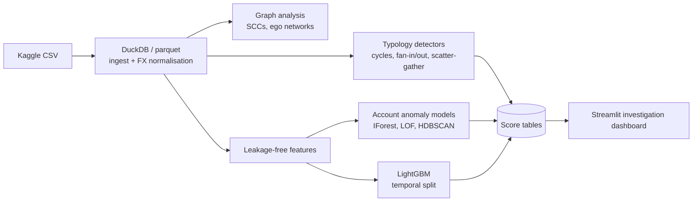

# Anti-money laundering detection on the IBM synthetic transactions dataset


An end-to-end analytics project on the IBM "Transactions for Anti Money Laundering" data
(Altman et al., NeurIPS 2023; Kaggle `ealtman2019/ibm-transactions-for-anti-money-laundering-aml`).
It covers ingestion and currency normalisation, graph analysis, rule-based typology detectors,
unsupervised account anomaly detection, a supervised transaction model with strictly temporal
evaluation, and an interactive investigation dashboard.

> **Status:** all phases complete. Results below were produced on HI-Small and are reproducible
> from `make data features detect train` (a clean-clone run is described under "Reproducibility").

**At a glance** (5.1M transactions, 0.10% laundering)

| Approach | Result |
|---|---|
| Rule-based detectors | scatter-gather 34% precision, cycles 18%, against a 0.10% base rate |
| Unsupervised (Isolation Forest) | about 20x random precision in the top 100 accounts |
| Supervised LightGBM, strict temporal test | precision@100 0.99, PR-AUC 0.59 (0.41 before the late-period artefact) |

## Pipeline



## Set-up

Requires Python 3.10+ (developed on 3.13, Windows 11, 16 GB RAM).

```bash
python -m venv .venv
.venv/Scripts/python -m pip install -r requirements.txt -e .   # Linux/macOS: .venv/bin/python
```

Data: set `KAGGLE_API_TOKEN` (or save `~/.kaggle/access_token`), or place
`HI-Small_Trans.csv` and `HI-Small_Patterns.txt` in `data/raw/` manually. Never commit credentials.

`hdbscan` is skipped on Python 3.13 (no wheel); `sklearn.cluster.HDBSCAN` is used instead.

## Commands

`make` is not installed on Windows by default, so every target is also available as
`python -m aml.cli <target>`; the Makefile is a thin wrapper.

| Target | What it does |
|---|---|
| `make data` | Download, ingest to parquet, derive FX rates and `amt_usd`, parse and match the patterns file |
| `make features` | Account-level features and leakage-free transaction features |
| `make detect` | Rule-based detectors, detector evaluation, anomaly models and their evaluation |
| `make train` | Supervised LightGBM model, evaluation, SHAP plot, and precomputed score tables |
| `make app` | Launch the Streamlit dashboard (reads precomputed scores only) |
| `make test` | Run the test suite |

Everything is configured in `config.yaml`. Switching to `HI-Medium` or `LI-Small` needs only
`dataset.name` to change. Notebooks `01_eda`, `02_graph` and `03_results` are generated from the
`.py` files beside them with `jupytext` and executed with `jupyter nbconvert`.

## Methods

**Ingestion.** DuckDB reads the CSV (the header repeats `Account`, so columns are named by
position). Bank codes are kept as strings because leading zeros matter (`010` is not `10`).
Account IDs are only unique within a bank, so nodes are `f"{bank}_{account}"`. `txn_id` is the
row position in the raw file.

**Currency.** The data has no FX table. Rates are the median `amount_received / amount_paid`
per currency pair over cross-currency transactions of at least 100 units (tiny amounts are
rounded and noisy), chained to USD by breadth-first search from USD. `amt_usd` is the amount
paid times the paying currency's USD rate. The table is saved to `reports/tables/fx_rates.csv`
and sanity-checked against loose plausible ranges.

**Graph.** Whole-graph measures use DuckDB and scipy; NetworkX is used only on subgraphs.
`ego_subgraph` extracts a time-filtered k-hop neighbourhood straight from parquet and prunes to
the highest-value links beyond `max_nodes`.

**Detectors** (`src/aml/detectors.py`; each returns `detector, account_ids, txn_ids, start_ts,
end_ts, total_usd, score, detail`):

- *Temporal cycles.* Restricted to non-trivial strongly connected components. A time-respecting
  depth-first search finds loops of at most `cycle_length_bound` hops in which every hop is
  strictly later than the previous one, the loop fits within `cycle_window_days`, and every hop's
  USD amount is within `amount_tolerance` of the first. This accepts exactly the cycles an
  "enumerate simple cycles, then verify timing" pipeline would, without enumerating the many that
  fail the time test. Work and cycle caps are logged when hit.
- *Fan-in / fan-out.* Peak distinct counterparties in sliding 1- and 7-day windows (DuckDB window
  functions), flagged strictly above a population percentile.
- *Scatter-gather / gather-scatter.* Time-ordered two-hop paths. Scatter-gather: source and
  destination joined by at least `min_paths` distinct intermediaries. Gather-scatter: a hub that
  collects from at least `min_paths` sources and redistributes to at least `min_paths`
  destinations.
- *Pass-through.* Outflow close to inflow, short median dwell, enough activity. **This is a
  behavioural proxy for shell accounts.** The data has no jurisdiction or offshore field, so shell
  companies cannot be identified, only conduit-like behaviour.

**Account anomaly detection.** About 30 account features (degrees, flows, format mix, bursts,
dwell, PageRank, clustering, detector hit counts), log-transformed where heavy-tailed and
standardised. Isolation Forest on the full matrix; LOF and HDBSCAN in a 10-component PCA
subspace. HDBSCAN flags noise and small clusters. The ensemble is the mean normalised rank.
Metrics are tie-aware (many HDBSCAN scores tie at "noise").

**Supervised model.** LightGBM at transaction level, `scale_pos_weight`, early stopping on
validation PR-AUC, decision threshold tuned for minority-class F1 on validation. Split by time
(60/20/20 by transaction order). Features use only transactions *strictly earlier* than the one
scored: for sender and receiver, prior count, USD volume, distinct counterparties and
cross-currency share in 1/7/30-day windows, plus own-transaction features and whether the pair
has transacted before. Phase 3 findings and Phase 4 account features are **not** used, since they
are computed over the whole period and would leak information from after the split boundaries.
The `is_laundering` label is used only as the training target and for evaluation.

## Headline results

All on HI-Small (5,078,345 transactions, 515,088 accounts, 17.7 days, 5,177 laundering
transactions = 0.102%). Tables are in `reports/tables/`; `notebooks/03_results.ipynb` collects them.

**Data and structure**

- Only 3,209 of the 5,177 laundering transactions (62%) belong to a listed typology attempt.
- Laundering is 5x over-represented inside non-trivial strongly connected components (23.5% of
  laundering transactions vs 4.9% of all).

**Rule-based detectors** (transaction level; base rate 0.10%)

| Detector | Precision | Share of all laundering flagged |
|---|---|---|
| scatter-gather | 33.9% | 11.2% |
| temporal cycle | 18.1% | 5.8% |
| fan-out | 0.80% | 11.2% |
| gather-scatter | 0.19% | 30.8% |
| fan-in / pass-through | 0.44% / 0.13% | 3.9% / 2.9% |

The union covers 69% of the 370 attempts (at least half of an attempt's transactions flagged) at
0.23% precision. The cycle detector finds every cycle of up to 3 hops, 82% of 4-6 hops and none
of the 20 longer ones (bound of 6). Small attempts are covered by coincidence, so read the
diagonal of `detector_recall_by_typology.csv`, not the off-diagonal cells.

**Unsupervised account anomaly detection** (422,734 active accounts; 1.5% illicit)

| Method | PR-AUC | Precision@100 | Precision@1000 |
|---|---|---|---|
| Isolation Forest | 0.041 | 31% | 12.3% |
| Ensemble (mean rank) | 0.038 | 31% | 10.5% |
| LOF | 0.026 | 0% | 4.7% |
| HDBSCAN | 0.018 | 2.2% | 2.2% |
| Random | 0.015 | 1.5% | 1.5% |

Isolation Forest is about 20x random in the top 100. LOF and HDBSCAN add little, so the ensemble
does not beat Isolation Forest alone.

**Supervised transaction model** (LightGBM, test = last 20% by time)

| Slice | Positives | PR-AUC | F1 | Precision | Recall |
|---|---|---|---|---|---|
| Test (all) | 1,797 | 0.587 | 0.567 | 0.890 | 0.416 |
| Test, before 11 Sep | 1,142 | 0.407 | 0.426 | 0.805 | 0.290 |
| Test, from 11 Sep | 655 | 0.968 | 0.769 | 0.972 | 0.637 |

Precision@100 / @500 / @1000 on the test set: 0.99 / 0.98 / 0.83. The "before 11 Sep" row is the
fairer one (see the first limitation below): there, PR-AUC is about 370x the base rate. Recall by
typology on the test set: fan-out 0.80, gather-scatter 0.65, scatter-gather 0.61, fan-in 0.55,
cycle 0.50, stack 0.34, random 0.33, bipartite 0.23, and **0.4% for laundering transactions that
are in no listed attempt**: the model finds the structured laundering, not the unattributed kind.
The strongest features are whether the sender-receiver pair has transacted before, the sender's
recent inflow (a pass-through signature), payment format and amount.

A note on training: weighting the minority class by the full imbalance (about 1:1300) drove
predicted probabilities to exactly 1.0, tying the top ranks and collapsing precision@k. The final
model uses `scale_pos_weight = (neg/pos)^0.25` (about 6) with stronger regularisation, chosen on
validation PR-AUC only, and ranks by the raw margin.

## Reproducibility

`python -m aml.cli data features detect train` was run from a fresh clone with a new virtual
environment; see the repository history for the outcome. Runtime on a 16 GB laptop is dominated
by HDBSCAN (about 25 minutes); the whole pipeline takes roughly an hour. Seeds are fixed in
`config.yaml`, but multithreaded LightGBM and HDBSCAN can differ in the last decimals.

## Limitations

- **Synthetic data embeds its designers' assumptions.** The generator injects a fixed set of
  typologies with regular structure. Detectors and models that do well here may be learning the
  generator, not money laundering. Real laundering is adaptive, messier and rarer.
- **A time artefact dominates the late period.** Licit activity almost stops after 10 September
  while laundering attempts run on, so from 11 September 58-73% of transactions are laundering.
  Any model can exploit "little activity around" as a signal. The temporal test split straddles
  this regime; metrics are reported overall and by period for that reason.
- **No jurisdiction data.** There is no offshore or country attribute, so "shell-like" accounts
  are only a behavioural proxy (pass-through), not a statement about corporate structure.
- **Labels are incomplete for typologies.** 38% of laundering transactions have no attempt
  attribution, which caps typology-level recall and makes recall by typology a lower bound.
- **A real bank sees only its own slice of the network.** This project sees every account at
  every bank, including counterparties' onward flows. Cross-institution detection like this is
  not available to a single institution without data sharing.
- **False positives are costly.** At a base rate near 0.1%, even a detector with 99% specificity
  produces mostly false alerts. Each alert costs analyst time and can delay legitimate customers.
  Precision, not recall alone, should drive thresholds, and scores here are for triage, not
  decisions.
- **Scores on training data are optimistic.** The dashboard labels each transaction's split; only
  the test split is a fair evaluation.
- Cycle search is bounded by length (default 6, so longer laundering cycles are missed) and by
  work caps; gather-scatter hubs above `max_intermediary_txns` are skipped.

## Repository layout

```
config.yaml            all settings
src/aml/               ingest, currency, patterns, graph, detectors, features, anomaly,
                       supervised, evaluate, scoring, cli
app/streamlit_app.py   dashboard
notebooks/             01_eda, 02_graph, 03_results (+ .py sources)
reports/               tables/ (tracked) and figures/ (git-ignored, regenerated)
tests/                 pytest suite (also covers the dashboard with AppTest)
```

## License

MIT. See `LICENSE`. The IBM dataset is distributed under its own terms on Kaggle and is not
included in this repository.
